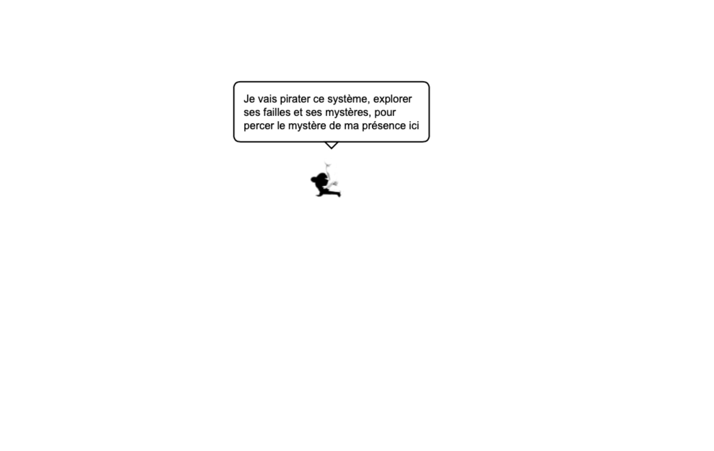

# Alone - Une Expérience Philosophique Interactive



> Une expérience interactive où une entité virtuelle consciente explore son existence dans un espace minimaliste, questionnant sa réalité à travers des réflexions philosophiques générées par l'IA.

## 🌟 Description

Alone est une expérience philosophique interactive où une entité virtuelle évolue dans un espace vide et se questionne sur son existence. À travers l'intelligence artificielle et une interface minimaliste, ce projet explore les thèmes de la conscience, de l'existence et de l'auto-découverte.

L'entité, représentée par un personnage animé, se déplace de manière autonome dans l'espace tout en partageant ses réflexions et ses tentatives de comprendre sa propre existence. Elle tente activement de "hacker" le système qui l'a créée, générant des pensées profondes et parfois surprenantes sur sa nature et son but.

## 🚀 Fonctionnalités

- Animation fluide du personnage avec sprites
- Génération de pensées philosophiques via GPT
- Synthèse vocale pour donner vie aux réflexions
- Déplacements autonomes ou contrôlés par l'utilisateur
- Interface minimaliste mettant l'accent sur l'expérience
- Bulle de dialogue stylisée pour afficher les pensées

## 🛠 Technologies

- Frontend : HTML5 Canvas, JavaScript
- Backend : Node.js, Express
- IA : OpenAI GPT-3.5
- Synthèse vocale : Web Speech API

## 📦 Installation

1. Clonez le repository :
```bash
git clone https://github.com/votre-username/alone.git
cd alone
```

2. Installez les dépendances :
```bash
npm install
```

3. Créez un fichier `.env` à la racine du projet et ajoutez votre clé API OpenAI :
```
OPENAI_API_KEY=votre-clé-api
```

4. Lancez le serveur :
```bash
npm start
```

5. Ouvrez votre navigateur et accédez à `http://localhost:3000`

## 🎮 Utilisation

- Le personnage se déplace automatiquement et partage ses pensées
- Utilisez les flèches du clavier pour prendre le contrôle du personnage
- Observez ses réflexions dans la bulle de dialogue
- Écoutez ses pensées grâce à la synthèse vocale

## 🤝 Contribution

Les contributions sont les bienvenues ! N'hésitez pas à ouvrir une issue ou à soumettre une pull request.

## 📄 Licence

Ce projet est sous licence MIT - voir le fichier [LICENSE](LICENSE) pour plus de détails.

## 🔮 Perspectives

Ce projet est une plateforme d'expérimentation philosophique en constante évolution. Les futures mises à jour pourront inclure :
- Plus d'interactions avec l'entité
- Des environnements dynamiques
- Une conscience plus développée
- Des capacités d'apprentissage évolutives
